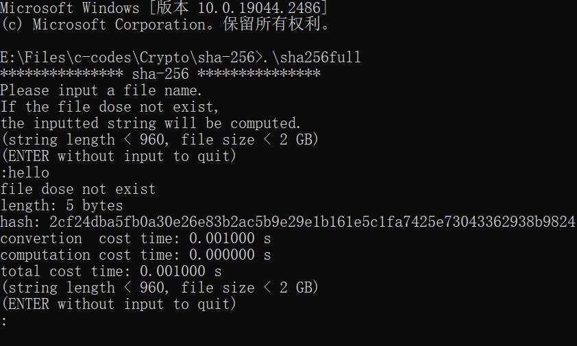
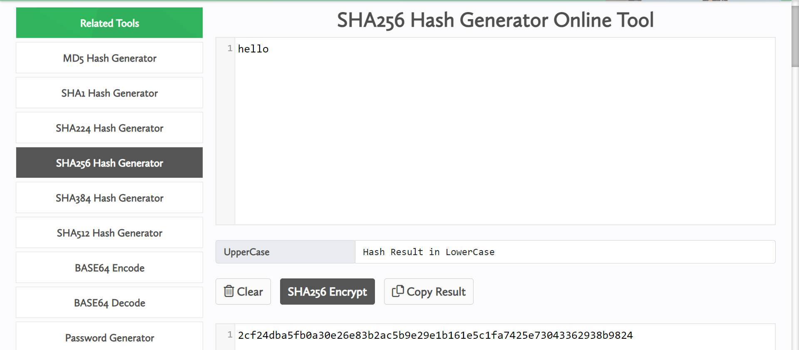
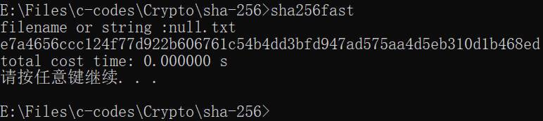
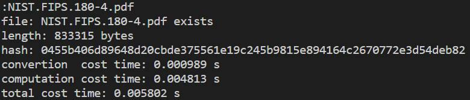
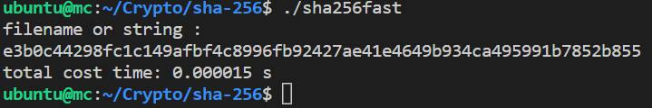

# SHA-256 Algorithm Implementation in C

中文版见 `README_zh.md`

- [SHA-256 Algorithm Implementation in C](#sha-256-algorithm-implementation-in-c)
  - [Introduction](#introduction)
  - [Algorithm](#algorithm)
  - [Implementation \& Features](#implementation--features)
  - [Download](#download)
    - [Windows](#windows)
      - [64-bit](#64-bit)
        - [win10\_x64](#win10_x64)
    - [Linux](#linux)
      - [64-bit](#64-bit-1)
        - [deb11\_x64](#deb11_x64)
        - [rasp4b\_64](#rasp4b_64)
      - [32-bit](#32-bit)
        - [rasp4b\_32](#rasp4b_32)
  - [Clone \& Build](#clone--build)
    - [Windows](#windows-1)
    - [Linux](#linux-1)
  - [Usage](#usage)
    - [Windows](#windows-2)
    - [Linux](#linux-2)
  - [Screenshots \& Test Results](#screenshots--test-results)
    - [Windows10 x64](#windows10-x64)
      - [sha256full.exe](#sha256fullexe)
      - [sha256fast.exe](#sha256fastexe)
      - [sha256min.exe](#sha256minexe)
    - [Ubuntu20.04 x64](#ubuntu2004-x64)
      - [sha256full](#sha256full)
      - [sha256fast](#sha256fast)
      - [sha256min](#sha256min)
  - [References](#references)
  - [Further Reading](#further-reading)


Author: [Robert1037](https://github.com/Robert1037)

Source: [github.com/Robert1037/Crypto-in-C/tree/master/sha-256](https://github.com/Robert1037/Crypto-in-C/tree/master/sha-256)

Releases: [github.com/Robert1037/Crypto-in-C/releases/tag/sha-256_v2.1_little-endian](https://github.com/Robert1037/Crypto-in-C/releases/tag/sha-256_v2.1_little-endian)

## Introduction

What is the SHA-256 algorithm? Here is the official explanation in [**Secure Hash Standard (SHS)**](https://nvlpubs.nist.gov/nistpubs/FIPS/NIST.FIPS.180-4.pdf) :

> This Standard specifies secure hash algorithms, SHA-1, SHA-224, SHA-256, SHA-384, SHA-512, SHA-512/224 and SHA-512/256. All of the algorithms are iterative, one-way hash functions that can process a message to produce a condensed representation called a message digest. These algorithms enable the determination of a message’s integrity: any change to the message will, with a very high probability, result in a different message digest. This property is useful in the generation and verification of digital signatures and message authentication codes, and in the generation of random numbers or bits.
>
> Each algorithm can be described in two stages: preprocessing and hash computation. Preprocessing involves padding a message, parsing the padded message into m-bit blocks, and setting initialization values to be used in the hash computation. The hash computation generates a message schedule from the padded message and uses that schedule, along with functions, constants, and word operations to iteratively generate a series of hash values. The final hash value generated by the hash computation is used to determine the message digest.

>SHA-256 may be used to hash a message, M, having a length of l bits, where 0 <= l < 2^64. The algorithm uses 1) a message schedule of sixty-four 32-bit words, 2) eight working variables of 32 bits each, and 3) a hash value of eight 32-bit words. The final result of SHA-256 is a 256-bit message digest.

## Algorithm

Read the following chapters and sections in [**Secure Hash Standard (SHS)**](https://nvlpubs.nist.gov/nistpubs/FIPS/NIST.FIPS.180-4.pdf) :

`2`  `3`  `4.1.2`  `4.2.2`  `5.1.1`  `5.2.1`  `5.3.3`  `6.2`

or read: [**RFC 6234: US Secure Hash Algorithms**](https://datatracker.ietf.org/doc/html/rfc6234)

## Implementation & Features

[sha256full.c](https://github.com/Robert1037/Crypto-in-C/blob/master/sha-256/sha256full.c) is the original version of [sha256fast.c](https://github.com/Robert1037/Crypto-in-C/blob/master/sha-256/sha256fast.c) and [sha256min.c](https://github.com/Robert1037/Crypto-in-C/blob/master/sha-256/sha256min.c). But `sha256full.c` and `sha256fast.c` are optimized, so their codes may be a little confusing. Thus I recommend reading `sha256min.c` first.

Here are the features (differences) :

| features       |    sha256full.c    |      sha256fast.c      | sha256min.c |
| -------------- | :----------------: | :--------------------: | :---------: |
| timer          |    **Yes** (3)     |      **Yes** (1)       |     No      |
| prompt         | **Yes** (detailed) |    **Yes** (brief)     |     No      |
| repetition     |      **Yes**       |           No           |     No      |
| string hashing |      **Yes**       | **Yes** (include NULL) |     No      |
| file hashing   |      **Yes**       |        **Yes**         |   **Yes**   |
| unroll loop    |    **Yes** (1)     |      **Yes** (18)      |     No      |

## Download

### Windows

#### 64-bit

##### win10_x64

sha256full_win10_x64.exe [github](https://github.com/Robert1037/Crypto-in-C/releases/download/sha-256_v2.1_little-endian/sha256full_win10_x64.exe)  [sourceforge](https://sourceforge.net/projects/crypto-in-c/files/sha-256_v2.1_little-endian/sha256full_win10_x64.exe/download)

sha256fast_win10_x64.exe [github](https://github.com/Robert1037/Crypto-in-C/releases/download/sha-256_v2.1_little-endian/sha256fast_win10_x64.exe)  [sourceforge](https://sourceforge.net/projects/crypto-in-c/files/sha-256_v2.1_little-endian/sha256fast_win10_x64.exe/download)

sha256min_win10_x64.exe [github](https://github.com/Robert1037/Crypto-in-C/releases/download/sha-256_v2.1_little-endian/sha256min_win10_x64.exe)  [sourceforge](https://sourceforge.net/projects/crypto-in-c/files/sha-256_v2.1_little-endian/sha256min_win10_x64.exe/download)

**OS**

- Windows 10
- Windows 11

**CPU**

- Intel x64 (x86_64, amd64)
- AMD x64 (x86_64, amd64)

**Build Info**

```
Microsoft Windows 10

x64-based PC

GNU Make 4.2.1
Built for x86_64-w64-mingw32

gcc version 12.2.0 (x86_64-posix-seh-rev2, Built by MinGW-W64 project)
Using built-in specs.
COLLECT_GCC=D:\mingw64\bin\gcc.exe
COLLECT_LTO_WRAPPER=D:/mingw64/bin/../libexec/gcc/x86_64-w64-mingw32/12.2.0/lto-wrapper.exe
Target: x86_64-w64-mingw32
Configured with: ../../../src/gcc-12.2.0/configure --host=x86_64-w64-mingw32 --build=x86_64-w64-mingw32 --target=x86_64-w64-mingw32 --prefix=/mingw64 --with-sysroot=/c/mingw-builds/ucrt64-seh-posix/x86_64-1220-posix-seh-ucrt-rt_v10-rev2/mingw64 --enable-hot 
-shared --disable-multilib --enable-languages=c,c++,fortran,lto --enable-libstdcxx-time=yes --enable-threads=posix --enable-libgomp --enable-libatomic --enable-lto --enable-graphite --enable-checking=release --enable-fully-dynamic-string --enable-version-specific-runtime-libs --enable-libstdcxx-filesystem-ts=yes --disable-libstdcxx-pch --disable-libstdcxx-debug --enable-bootstrap --disable-rpath --disable-win32-registry --disable-nls --disable-werror --disable-symvers --with-gnu-as --with-gnu-ld --with-arch=nocona --with-tune=core2 --with-libiconv --with-system-zlib --with-gmp=/c/mingw-builds/ucrt64-seh-posix/prerequisites/x86_64-w64-mingw32-static --with-mpfr=/c/mingw-builds/ucrt64-seh-posix/prerequisites/x86_64-w64-mingw32-static --with-mpc=/c/mingw-builds/ucrt64-seh-posix/prerequisites/x86_64-w64-mingw32-static --with-isl=/c/mingw-builds/ucrt64-seh-posix/prerequisites/x86_64-w64-mingw32-static --with-pkgversion='x86_64-posix-seh-rev2, Built by MinGW-W64 project' --with-bugurl=https://sourceforge.net/projects/mingw-w64 CFLAGS='-O2 -pipe -fno-ident -I/c/mingw-builds/ucrt64-seh-posix/x86_64-1220-posix-seh-ucrt-rt_v10-rev2/mingw64/opt/include -I/c/mingw-builds/ucrt64-seh-posix/prerequisites/x86_64-zlib-static/include -I/c/mingw-builds/ucrt64-seh-posix/prerequisites/x86_64-w64-mingw32-static/include' CXXFLAGS='-O2 -pipe -fno-ident -I/c/mingw-builds/ucrt64-seh-posix/x86_64-1220-posix-seh-ucrt-rt_v10-rev2/mingw64/opt/include -I/c/mingw-builds/ucrt64-seh-posix/prerequisites/x86_64-zlib-static/include -I/c/mingw-builds/ucrt64-seh-posix/prerequisites/x86_64-w64-mingw32-static/include' CPPFLAGS=' -I/c/mingw-builds/ucrt64-seh-posix/x86_64-1220-posix-seh-ucrt-rt_v10-rev2/mingw64/opt/include -I/c/mingw-builds/ucrt64-seh-posix/prerequisites/x86_64-zlib-static/include -I/c/mingw-builds/ucrt64-seh-posix/prerequisites/x86_64-w64-mingw32-static/include' LDFLAGS='-pipe -fno-ident -L/c/mingw-builds/ucrt64-seh-posix/x86_64-1220-posix-seh-ucrt-rt_v10-rev2/mingw64/opt/lib -L/c/mingw-builds/ucrt64-seh-posix/prerequisites/x86_64-zlib-static/lib -L/c/mingw-builds/ucrt64-seh-posix/prerequisites/x86_64-w64-mingw32-static/lib ' LD_FOR_TARGET=/c/mingw-builds/ucrt64-seh-posix/x86_64-1220-posix-seh-ucrt-rt_v10-rev2/mingw64/bin/ld.exe --with-boot-ldflags=' -Wl,--disable-dynamicbase -static-libstdc++ -static-libgcc'
Thread model: posix
Supported LTO compression algorithms: zlib
```

### Linux

#### 64-bit

##### deb11_x64

sha256full_deb11_x64 [github](https://github.com/Robert1037/Crypto-in-C/releases/download/sha-256_v2.1_little-endian/sha256full_deb11_x64)  [sourceforge](https://sourceforge.net/projects/crypto-in-c/files/sha-256_v2.1_little-endian/sha256full_deb11_x64/download)

sha256fast_deb11_x64 [github](https://github.com/Robert1037/Crypto-in-C/releases/download/sha-256_v2.1_little-endian/sha256fast_deb11_x64)  [sourceforge](https://sourceforge.net/projects/crypto-in-c/files/sha-256_v2.1_little-endian/sha256fast_deb11_x64/download)

sha256min_deb11_x64 [github](https://github.com/Robert1037/Crypto-in-C/releases/download/sha-256_v2.1_little-endian/sha256min_deb11_x64)  [sourceforge](https://sourceforge.net/projects/crypto-in-c/files/sha-256_v2.1_little-endian/sha256min_deb11_x64/download)

**OS**

- Debian 11 (bullseye) amd64
- Debian 12 (bookworm) amd64
- Ubuntu 20.04 (focal) amd64
- Ubuntu 22.04 (jammy) amd64

**CPU**

- Intel x64 (x86_64, amd64)
- AMD x64 (x86_64, amd64)

**Build Info**

```
Debian GNU/Linux 11 (bullseye)

Linux version 5.10.0-18-cloud-amd64

GNU Make 4.3
Built for x86_64-pc-linux-gnu

gcc version 10.2.1 20210110 (Debian 10.2.1-6)
Using built-in specs.
COLLECT_GCC=gcc
COLLECT_LTO_WRAPPER=/usr/lib/gcc/x86_64-linux-gnu/10/lto-wrapper
OFFLOAD_TARGET_NAMES=nvptx-none:amdgcn-amdhsa:hsa
OFFLOAD_TARGET_DEFAULT=1
Target: x86_64-linux-gnu
Configured with: ../src/configure -v --with-pkgversion='Debian 10.2.1-6' --with-bugurl=file:///usr/share/doc/gcc-10/README.Bugs --enable-languages=c,ada,c++,go,brig,d,fortran,objc,obj-c++,m2 --prefix=/usr --with-gcc-major-version-only --program-suffix=-10 --program-prefix=x86_64-linux-gnu- --enable-shared --enable-linker-build-id --libexecdir=/usr/lib --without-included-gettext --enable-threads=posix --libdir=/usr/lib --enable-nls --enable-bootstrap --enable-clocale=gnu --enable-libstdcxx-debug --enable-libstdcxx-time=yes --with-default-libstdcxx-abi=new --enable-gnu-unique-object --disable-vtable-verify --enable-plugin --enable-default-pie --with-system-zlib --enable-libphobos-checking=release --with-target-system-zlib=auto --enable-objc-gc=auto --enable-multiarch --disable-werror --with-arch-32=i686 --with-abi=m64 --with-multilib-list=m32,m64,mx32 --enable-multilib --with-tune=generic --enable-offload-targets=nvptx-none=/build/gcc-10-Km9U7s/gcc-10-10.2.1/debian/tmp-nvptx/usr,amdgcn-amdhsa=/build/gcc-10-Km9U7s/gcc-10-10.2.1/debian/tmp-gcn/usr,hsa --without-cuda-driver --enable-checking=release --build=x86_64-linux-gnu --host=x86_64-linux-gnu --target=x86_64-linux-gnu --with-build-config=bootstrap-lto-lean --enable-link-mutex
Thread model: posix
Supported LTO compression algorithms: zlib zstd
```

##### rasp4b_64

sha256full_rasp4b_64 [github](https://github.com/Robert1037/Crypto-in-C/releases/download/sha-256_v2.1_little-endian/sha256full_rasp4b_64)  [sourceforge](https://sourceforge.net/projects/crypto-in-c/files/sha-256_v2.1_little-endian/sha256full_rasp4b_64/download)

sha256fast_rasp4b_64 [github](https://github.com/Robert1037/Crypto-in-C/releases/download/sha-256_v2.1_little-endian/sha256fast_rasp4b_64)  [sourceforge](https://sourceforge.net/projects/crypto-in-c/files/sha-256_v2.1_little-endian/sha256fast_rasp4b_64/download)

sha256min_rasp4b_64 [github](https://github.com/Robert1037/Crypto-in-C/releases/download/sha-256_v2.1_little-endian/sha256min_rasp4b_64)  [sourceforge](https://sourceforge.net/projects/crypto-in-c/files/sha-256_v2.1_little-endian/sha256min_rasp4b_64/download)

**OS**

- Raspbian 11 (i.e. Debian 11) aarch64
- Ubuntu 20.04 (focal) aarch64
- Ubuntu 22.04 (jammy) aarch64

**Hardware**

- Raspberry Pi 4 Model B

**Build Info**

```
Debian GNU/Linux 11 (bullseye)

Linux version 5.15.61-v8+

GNU Make 4.3
Built for aarch64-unknown-linux-gnu

gcc version 10.2.1 20210110 (Debian 10.2.1-6)
Using built-in specs.
COLLECT_GCC=gcc
COLLECT_LTO_WRAPPER=/usr/lib/gcc/aarch64-linux-gnu/10/lto-wrapper
Target: aarch64-linux-gnu
Configured with: ../src/configure -v --with-pkgversion='Debian 10.2.1-6' --with-bugurl=file:///usr/share/doc/gcc-10/README.Bugs --enable-languages=c,ada,c++,go,d,fortran,objc,obj-c++,m2 --prefix=/usr --with-gcc-major-version-only --program-suffix=-10 --program-prefix=aarch64-linux-gnu- --enable-shared --enable-linker-build-id --libexecdir=/usr/lib --without-included-gettext --enable-threads=posix --libdir=/usr/lib --enable-nls --enable-bootstrap --enable-clocale=gnu --enable-libstdcxx-debug --enable-libstdcxx-time=yes --with-default-libstdcxx-abi=new --enable-gnu-unique-object --disable-libquadmath --disable-libquadmath-support --enable-plugin --enable-default-pie --with-system-zlib --enable-libphobos-checking=release --with-target-system-zlib=auto --enable-objc-gc=auto --enable-multiarch --enable-fix-cortex-a53-843419 --disable-werror --enable-checking=release --build=aarch64-linux-gnu --host=aarch64-linux-gnu --target=aarch64-linux-gnu --with-build-config=bootstrap-lto-lean --enable-link-mutex
Thread model: posix
Supported LTO compression algorithms: zlib zstd
```

#### 32-bit

##### rasp4b_32

sha256full_rasp4b_32 [github](https://github.com/Robert1037/Crypto-in-C/releases/download/sha-256_v2.1_little-endian/sha256full_rasp4b_32)  [sourceforge](https://sourceforge.net/projects/crypto-in-c/files/sha-256_v2.1_little-endian/sha256full_rasp4b_32/download)

sha256fast_rasp4b_32 [github](https://github.com/Robert1037/Crypto-in-C/releases/download/sha-256_v2.1_little-endian/sha256fast_rasp4b_32)  [sourceforge](https://sourceforge.net/projects/crypto-in-c/files/sha-256_v2.1_little-endian/sha256fast_rasp4b_32/download)

sha256min_rasp4b_32 [github](https://github.com/Robert1037/Crypto-in-C/releases/download/sha-256_v2.1_little-endian/sha256min_rasp4b_32)  [sourceforge](https://sourceforge.net/projects/crypto-in-c/files/sha-256_v2.1_little-endian/sha256min_rasp4b_32/download)

**OS**

- Raspbian 11 armhf
- Ubuntu 20.04 (focal) armhf
- Ubuntu 22.04 (jammy) armhf

**Hardware**

- Raspberry Pi 4 Model B

**Build Info**

```
Raspbian GNU/Linux 11 (bullseye)

Linux version 5.15.61-v7l+

GNU Make 4.3
Built for arm-unknown-linux-gnueabihf

gcc version 10.2.1 20210110 (Raspbian 10.2.1-6+rpi1)
Using built-in specs.
COLLECT_GCC=gcc
COLLECT_LTO_WRAPPER=/usr/lib/gcc/arm-linux-gnueabihf/10/lto-wrapper
Target: arm-linux-gnueabihf
Configured with: ../src/configure -v --with-pkgversion='Raspbian 10.2.1-6+rpi1' --with-bugurl=file:///usr/share/doc/gcc-10/README.Bugs --enable-languages=c,ada,c++,go,d,fortran,objc,obj-c++,m2 --prefix=/usr --with-gcc-major-version-only --program-suffix=-10 --program-prefix=arm-linux-gnueabihf- --enable-shared --enable-linker-build-id --libexecdir=/usr/lib --without-included-gettext --enable-threads=posix --libdir=/usr/lib --enable-nls --enable-bootstrap --enable-clocale=gnu --enable-libstdcxx-debug --enable-libstdcxx-time=yes --with-default-libstdcxx-abi=new --enable-gnu-unique-object --disable-libitm --disable-libquadmath --disable-libquadmath-support --enable-plugin --with-system-zlib --enable-libphobos-checking=release --with-target-system-zlib=auto --enable-objc-gc=auto --enable-multiarch --disable-sjlj-exceptions --with-arch=armv6 --with-fpu=vfp --with-float=hard --disable-werror --enable-checking=release --build=arm-linux-gnueabihf --host=arm-linux-gnueabihf --target=arm-linux-gnueabihf
Thread model: posix
Supported LTO compression algorithms: zlib zstd
```

## Clone & Build

Download [source_of_sha-256_v2.1_little-endian.zip](https://github.com/Robert1037/Crypto-in-C/releases/download/sha-256_v2.1_little-endian/source_of_sha-256_v2.1_little-endian.zip) or [source_of_sha-256_v2.1_little-endian.tar.gz](https://github.com/Robert1037/Crypto-in-C/releases/download/sha-256_v2.1_little-endian/source_of_sha-256_v2.1_little-endian.tar.gz)

or

```
git clone https://github.com/Robert1037/Crypto-in-C.git
```

### Windows

Download the latest version of **mingw**: https://github.com/niXman/mingw-builds-binaries/releases4

Build one of them: (e.g. sha256full)

```powershell
> mingw32-make full
```

Build all: (by default)

```powershell
> mingw32-make
```

### Linux

Prerequisites: **gcc**, **make**

Build one of them: (e.g. sha256full)

```bash
$ make full
```

Build all: (by default)

```bash
$ make
```

## Usage

### Windows

**sha256full**

- [x] `cmd` or `powershell`
- [x] double click `.exe`

```powershell
> .\sha256full
*************** sha-256 ***************
Please input a file name.
If the file dose not exist,
the inputted string will be computed.
(string length < 960, file size < 2 GB)
(ENTER without input to quit)
:
```

**sha256fast**

- [x] `cmd` or `powershell`
- [x] double click `.exe`

```powershell
> .\sha256fast
filename or string :
```

**sha256min**

- [x] `cmd` or `powershell`
- [ ] double click `.exe`

```powershell
> .\sha256min <filename>
```

### Linux

**sha256full**

```bash
$ ./sha256full
*************** sha-256 ***************
Please input a file name.
If the file dose not exist,
the inputted string will be computed.
(string length < 960, file size < 2 GB)
(ENTER without input to quit)
:
```

**sha256fast**

```bash
$ ./sha256fast
filename or string :
```

**sha256min**

```bash
$ ./sha256min <filename>
```

## Screenshots & Test Results

### Windows10 x64

Verification tools:

https://coding.tools/sha256 

and

```powershell
> certutil -hashfile <filename> sha256
```

#### sha256full.exe

`hello`





`null.txt`


`NIST.FIPS.180-4.pdf`


`..\..\test.mp4`


`..\..\movie.mp4`


(Press `ENTER` key directly)


#### sha256fast.exe

(Press `ENTER` key directly)


`hello`


`null.txt`



`NIST.FIPS.180-4.pdf`


`..\..\movie.mp4`


#### sha256min.exe

(Press `ENTER` key directly)


`null.txt`


`NIST.FIPS.180-4.pdf`


`..\..\movie.mp4`


### Ubuntu20.04 x64

Verification tool:

```bash
$ sha256sum <filename>
```

#### sha256full

`hello`


`NIST.FIPS.180-4.pdf`



#### sha256fast

(Press `ENTER` key directly)



`hello`


`NIST.FIPS.180-4.pdf`


#### sha256min

`null.txt`


`NIST.FIPS.180-4.pdf`


Verification:


## References

[1] Wade Trappe, Lawrence C. Washington. **Introduction to Cryptography with Coding Theory (3rd edition)** [M]. Hoboken: Pearson Education, 2020: 499-521.

[2] FIPS PUB 180-4. **Secure Hash Standard (SHS)** [S]. http://dx.doi.org/10.6028/NIST.FIPS.180-4

[3] Datacruiser. **一文读懂SHA256算法原理及其实现**. https://zhuanlan.zhihu.com/p/94619052

[4] 小Q谈移动安全. **【密码学】一文读懂SHA-2**. https://zhuanlan.zhihu.com/p/404879837

## Further Reading

[1] Henri Gilbert, Helena Handschuh. **Security Analysis of SHA-256 and Sisters**. https://link.springer.com/content/pdf/10.1007/978-3-540-24654-1_13.pdf

[2] in3rsha. **sha256-animation**. https://github.com/in3rsha/sha256-animation

[3] https://csrc.nist.gov/CSRC/media/Projects/Cryptographic-Standards-and-Guidelines/documents/examples/SHA256.pdf
