# SHA-256算法的C语言实现

- [SHA-256算法的C语言实现](#sha-256算法的c语言实现)
  - [简介](#简介)
  - [算法](#算法)
  - [代码实现及其特性](#代码实现及其特性)
  - [下载](#下载)
    - [Windows系统](#windows系统)
      - [64位](#64位)
        - [win10\_x64](#win10_x64)
    - [Linux系统](#linux系统)
      - [64位](#64位-1)
        - [deb11\_x64](#deb11_x64)
        - [rasp4b\_64](#rasp4b_64)
      - [32位](#32位)
        - [rasp4b\_32](#rasp4b_32)
  - [克隆代码和编译](#克隆代码和编译)
    - [Windows系统](#windows系统-1)
    - [Linux系统](#linux系统-1)
  - [使用方法](#使用方法)
    - [Windows系统](#windows系统-2)
    - [Linux系统](#linux系统-2)
  - [程序测试结果截图](#程序测试结果截图)
    - [Windows10 x64](#windows10-x64)
      - [sha256full.exe](#sha256fullexe)
      - [sha256fast.exe](#sha256fastexe)
      - [sha256min.exe](#sha256minexe)
    - [Ubuntu20.04 x64](#ubuntu2004-x64)
      - [sha256full](#sha256full)
      - [sha256fast](#sha256fast)
      - [sha256min](#sha256min)
  - [参考资料](#参考资料)
  - [延伸阅读](#延伸阅读)


作者: [Robert1037](https://github.com/Robert1037)

代码仓库: [github.com/Robert1037/Crypto-in-C/tree/master/sha-256](https://github.com/Robert1037/Crypto-in-C/tree/master/sha-256)

程序发行: [github.com/Robert1037/Crypto-in-C/releases/tag/sha-256_v2.1_little-endian](https://github.com/Robert1037/Crypto-in-C/releases/tag/sha-256_v2.1_little-endian)

## 简介

什么是SHA算法？这是 [**安全散列标准 (SHS)**](https://nvlpubs.nist.gov/nistpubs/FIPS/NIST.FIPS.180-4.pdf) 的官方定义/解释：

> This Standard specifies secure hash algorithms, SHA-1, SHA-224, SHA-256, SHA-384, SHA-512, SHA-512/224 and SHA-512/256. All of the algorithms are iterative, one-way hash functions that can process a message to produce a condensed representation called a message digest. These algorithms enable the determination of a message’s integrity: any change to the message will, with a very high probability, result in a different message digest. This property is useful in the generation and verification of digital signatures and message authentication codes, and in the generation of random numbers or bits.
>
> Each algorithm can be described in two stages: preprocessing and hash computation. Preprocessing involves padding a message, parsing the padded message into m-bit blocks, and setting initialization values to be used in the hash computation. The hash computation generates a message schedule from the padded message and uses that schedule, along with functions, constants, and word operations to iteratively generate a series of hash values. The final hash value generated by the hash computation is used to determine the message digest.

大致翻译：

本标准指定了一些安全散列算法：SHA-1、SHA-224、SHA-256、SHA-384、SHA-512、SHA-512/224 和 SHA-512/256。所有这些算法都是迭代、单向的散列函数，可以处理消息生成一个消息摘要。这些算法能够确定消息的完整性：对消息的任何修改都将极大概率地导致最后生成一个不同的消息摘要。该特性可用于数字签名和消息认证码的生成和验证，以及随机数或随机比特序列的生成。

每个算法都可以被描述为两个步骤：预处理和散列值计算。预处理包括填充消息、把填充后的消息解析为多个m比特的块、以及设置被用于散列值计算的初始值。散列值的计算是联合利用填充好的消息、函数、常数和字处理操作来迭代地生成一系列的散列值。最终的散列值就是所求的消息摘要。

## 算法

阅读 [**安全散列标准 (SHS)**](https://nvlpubs.nist.gov/nistpubs/FIPS/NIST.FIPS.180-4.pdf) 的以下章节：

`2`  `3`  `4.1.2`  `4.2.2`  `5.1.1`  `5.2.1`  `5.3.3`  `6.2`

或者阅读 [**RFC 6234: 美国安全散列算法**](https://rfc2cn.com/rfc6234.html)

## 代码实现及其特性

[sha256fast.c](https://github.com/Robert1037/Crypto-in-C/blob/master/sha-256/sha256fast.c) 和 [sha256min.c](https://github.com/Robert1037/Crypto-in-C/blob/master/sha-256/sha256min.c)  是 [sha256full.c](https://github.com/Robert1037/Crypto-in-C/blob/master/sha-256/sha256full.c) 的分支，即 `sha256full.c` 是最初版本，但是 `sha256full.c` 和 `sha256fast.c` 在代码上都经过了一些优化，所以可能会较难读懂，因此建议先看 `sha256min.c` 。

这是三版代码的功能特性对照：

| 功能/特性          |   sha256full.c   |     sha256fast.c      | sha256min.c |
| ------------------ | :--------------: | :-------------------: | :---------: |
| 计时器             | **有** (3个时间) |   **有** (1个时间)    |     无      |
| 提示信息           |  **有** (详细)   |     **有** (简略)     |     无      |
| 可多次输入         |      **是**      |          否           |     否      |
| 计算字符串的散列值 |      **是**      | **是** (包括空字符串) |     否      |
| 计算文件的散列值   |      **是**      |        **是**         |   **是**    |
| 代码中循环体展开   |   **是** (1次)   |     **是** (18次)     |     否      |

详细言之，即 `sha256full.c` 和 `sha256fast.c` 都可在屏幕显示程序运行所需的时间，其中前者可显示读取文件并进行预处理的时间、计算散列值的时间、总共花费的时间，后者只显示一个总共花费的时间。

 `sha256full.c` 的程序在等待用户输入时会有详细的提示信息，指导用户如何正确输入，并提示被求散列值的文件大小的范围，另外如果程序读取文件失败或内存分配出错，都会显示报错信息。 `sha256fast.c` 的程序则只会显示一条等待输入的提示信息和文件不存在时的提示信息。`sha256min.c` 的程序使用方式为命令行，整个运行过程不显示任何提示信息。

 `sha256full.c` 的程序支持一次运行多次输入并计算，直到用户不输入消息直接按下 `回车键` 才结束进程，适合需要计算多个文件的散列值的场景。 `sha256fast.c` 和 `sha256min.c` 的程序一次运行均只能输入一次消息。

 `sha256full.c` 和 `sha256fast.c` 的程序都首先默认用户输入的消息是本地文件名，优先对指定路径存在的文件计算散列值。若文件不存在，则提示文件不存在并转而计算用户所输入字符串的散列值。 `sha256min.c` 的程序使用命令行运行，以程序参数的方式接收文件名的输入，若文件存在且计算成功则输出一行最终结果，其它任何情况均不输出任何结果。

总而言之， `sha256full.c` 的程序提示信息最完善、功能相对最强大、计算速度较快（中等）。 `sha256fast.c` 的代码优化级别相对最高（展开循环18次），计算速度相对最快。 `sha256min.c` 的程序体积相对最小，计算速度相对最慢，但对于1GB以内的文件其计算速度与最快版程序差别很小（可能大概1至2秒或1秒以内），不影响使用体验。因此本人推荐可将 `sha256fast` 程序添加进用户路径或系统路径作为日常使用，其运行速度可与操作系统自带的sha256散列计算命令行工具不相上下，使用体验上则由于计时功能的存在而似乎更胜一筹。

## 下载

### Windows系统

#### 64位

##### win10_x64

sha256full_win10_x64.exe [github](https://github.com/Robert1037/Crypto-in-C/releases/download/sha-256_v2.1_little-endian/sha256full_win10_x64.exe)  [sourceforge](https://sourceforge.net/projects/crypto-in-c/files/sha-256_v2.1_little-endian/sha256full_win10_x64.exe/download)

sha256fast_win10_x64.exe [github](https://github.com/Robert1037/Crypto-in-C/releases/download/sha-256_v2.1_little-endian/sha256fast_win10_x64.exe)  [sourceforge](https://sourceforge.net/projects/crypto-in-c/files/sha-256_v2.1_little-endian/sha256fast_win10_x64.exe/download)

sha256min_win10_x64.exe [github](https://github.com/Robert1037/Crypto-in-C/releases/download/sha-256_v2.1_little-endian/sha256min_win10_x64.exe)  [sourceforge](https://sourceforge.net/projects/crypto-in-c/files/sha-256_v2.1_little-endian/sha256min_win10_x64.exe/download)

**操作系统**

- Windows 10
- Windows 11

**CPU**

- Intel x64 (x86_64, amd64)
- AMD x64 (x86_64, amd64)

**编译工具信息**

```
Microsoft Windows 10

x64-based PC

GNU Make 4.2.1
Built for x86_64-w64-mingw32

gcc version 12.2.0 (x86_64-posix-seh-rev2, Built by MinGW-W64 project)
Using built-in specs.
COLLECT_GCC=D:\mingw64\bin\gcc.exe
COLLECT_LTO_WRAPPER=D:/mingw64/bin/../libexec/gcc/x86_64-w64-mingw32/12.2.0/lto-wrapper.exe
Target: x86_64-w64-mingw32
Configured with: ../../../src/gcc-12.2.0/configure --host=x86_64-w64-mingw32 --build=x86_64-w64-mingw32 --target=x86_64-w64-mingw32 --prefix=/mingw64 --with-sysroot=/c/mingw-builds/ucrt64-seh-posix/x86_64-1220-posix-seh-ucrt-rt_v10-rev2/mingw64 --enable-hot 
-shared --disable-multilib --enable-languages=c,c++,fortran,lto --enable-libstdcxx-time=yes --enable-threads=posix --enable-libgomp --enable-libatomic --enable-lto --enable-graphite --enable-checking=release --enable-fully-dynamic-string --enable-version-specific-runtime-libs --enable-libstdcxx-filesystem-ts=yes --disable-libstdcxx-pch --disable-libstdcxx-debug --enable-bootstrap --disable-rpath --disable-win32-registry --disable-nls --disable-werror --disable-symvers --with-gnu-as --with-gnu-ld --with-arch=nocona --with-tune=core2 --with-libiconv --with-system-zlib --with-gmp=/c/mingw-builds/ucrt64-seh-posix/prerequisites/x86_64-w64-mingw32-static --with-mpfr=/c/mingw-builds/ucrt64-seh-posix/prerequisites/x86_64-w64-mingw32-static --with-mpc=/c/mingw-builds/ucrt64-seh-posix/prerequisites/x86_64-w64-mingw32-static --with-isl=/c/mingw-builds/ucrt64-seh-posix/prerequisites/x86_64-w64-mingw32-static --with-pkgversion='x86_64-posix-seh-rev2, Built by MinGW-W64 project' --with-bugurl=https://sourceforge.net/projects/mingw-w64 CFLAGS='-O2 -pipe -fno-ident -I/c/mingw-builds/ucrt64-seh-posix/x86_64-1220-posix-seh-ucrt-rt_v10-rev2/mingw64/opt/include -I/c/mingw-builds/ucrt64-seh-posix/prerequisites/x86_64-zlib-static/include -I/c/mingw-builds/ucrt64-seh-posix/prerequisites/x86_64-w64-mingw32-static/include' CXXFLAGS='-O2 -pipe -fno-ident -I/c/mingw-builds/ucrt64-seh-posix/x86_64-1220-posix-seh-ucrt-rt_v10-rev2/mingw64/opt/include -I/c/mingw-builds/ucrt64-seh-posix/prerequisites/x86_64-zlib-static/include -I/c/mingw-builds/ucrt64-seh-posix/prerequisites/x86_64-w64-mingw32-static/include' CPPFLAGS=' -I/c/mingw-builds/ucrt64-seh-posix/x86_64-1220-posix-seh-ucrt-rt_v10-rev2/mingw64/opt/include -I/c/mingw-builds/ucrt64-seh-posix/prerequisites/x86_64-zlib-static/include -I/c/mingw-builds/ucrt64-seh-posix/prerequisites/x86_64-w64-mingw32-static/include' LDFLAGS='-pipe -fno-ident -L/c/mingw-builds/ucrt64-seh-posix/x86_64-1220-posix-seh-ucrt-rt_v10-rev2/mingw64/opt/lib -L/c/mingw-builds/ucrt64-seh-posix/prerequisites/x86_64-zlib-static/lib -L/c/mingw-builds/ucrt64-seh-posix/prerequisites/x86_64-w64-mingw32-static/lib ' LD_FOR_TARGET=/c/mingw-builds/ucrt64-seh-posix/x86_64-1220-posix-seh-ucrt-rt_v10-rev2/mingw64/bin/ld.exe --with-boot-ldflags=' -Wl,--disable-dynamicbase -static-libstdc++ -static-libgcc'
Thread model: posix
Supported LTO compression algorithms: zlib
```

### Linux系统

#### 64位

##### deb11_x64

sha256full_deb11_x64 [github](https://github.com/Robert1037/Crypto-in-C/releases/download/sha-256_v2.1_little-endian/sha256full_deb11_x64)  [sourceforge](https://sourceforge.net/projects/crypto-in-c/files/sha-256_v2.1_little-endian/sha256full_deb11_x64/download)

sha256fast_deb11_x64 [github](https://github.com/Robert1037/Crypto-in-C/releases/download/sha-256_v2.1_little-endian/sha256fast_deb11_x64)  [sourceforge](https://sourceforge.net/projects/crypto-in-c/files/sha-256_v2.1_little-endian/sha256fast_deb11_x64/download)

sha256min_deb11_x64 [github](https://github.com/Robert1037/Crypto-in-C/releases/download/sha-256_v2.1_little-endian/sha256min_deb11_x64)  [sourceforge](https://sourceforge.net/projects/crypto-in-c/files/sha-256_v2.1_little-endian/sha256min_deb11_x64/download)

**操作系统**

- Debian 11 (bullseye) amd64
- Debian 12 (bookworm) amd64
- Ubuntu 20.04 (focal) amd64
- Ubuntu 22.04 (jammy) amd64

**CPU**

- Intel x64 (x86_64, amd64)
- AMD x64 (x86_64, amd64)

**编译工具信息**

```
Debian GNU/Linux 11 (bullseye)

Linux version 5.10.0-18-cloud-amd64

GNU Make 4.3
Built for x86_64-pc-linux-gnu

gcc version 10.2.1 20210110 (Debian 10.2.1-6)
Using built-in specs.
COLLECT_GCC=gcc
COLLECT_LTO_WRAPPER=/usr/lib/gcc/x86_64-linux-gnu/10/lto-wrapper
OFFLOAD_TARGET_NAMES=nvptx-none:amdgcn-amdhsa:hsa
OFFLOAD_TARGET_DEFAULT=1
Target: x86_64-linux-gnu
Configured with: ../src/configure -v --with-pkgversion='Debian 10.2.1-6' --with-bugurl=file:///usr/share/doc/gcc-10/README.Bugs --enable-languages=c,ada,c++,go,brig,d,fortran,objc,obj-c++,m2 --prefix=/usr --with-gcc-major-version-only --program-suffix=-10 --program-prefix=x86_64-linux-gnu- --enable-shared --enable-linker-build-id --libexecdir=/usr/lib --without-included-gettext --enable-threads=posix --libdir=/usr/lib --enable-nls --enable-bootstrap --enable-clocale=gnu --enable-libstdcxx-debug --enable-libstdcxx-time=yes --with-default-libstdcxx-abi=new --enable-gnu-unique-object --disable-vtable-verify --enable-plugin --enable-default-pie --with-system-zlib --enable-libphobos-checking=release --with-target-system-zlib=auto --enable-objc-gc=auto --enable-multiarch --disable-werror --with-arch-32=i686 --with-abi=m64 --with-multilib-list=m32,m64,mx32 --enable-multilib --with-tune=generic --enable-offload-targets=nvptx-none=/build/gcc-10-Km9U7s/gcc-10-10.2.1/debian/tmp-nvptx/usr,amdgcn-amdhsa=/build/gcc-10-Km9U7s/gcc-10-10.2.1/debian/tmp-gcn/usr,hsa --without-cuda-driver --enable-checking=release --build=x86_64-linux-gnu --host=x86_64-linux-gnu --target=x86_64-linux-gnu --with-build-config=bootstrap-lto-lean --enable-link-mutex
Thread model: posix
Supported LTO compression algorithms: zlib zstd
```

##### rasp4b_64

sha256full_rasp4b_64 [github](https://github.com/Robert1037/Crypto-in-C/releases/download/sha-256_v2.1_little-endian/sha256full_rasp4b_64)  [sourceforge](https://sourceforge.net/projects/crypto-in-c/files/sha-256_v2.1_little-endian/sha256full_rasp4b_64/download)

sha256fast_rasp4b_64 [github](https://github.com/Robert1037/Crypto-in-C/releases/download/sha-256_v2.1_little-endian/sha256fast_rasp4b_64)  [sourceforge](https://sourceforge.net/projects/crypto-in-c/files/sha-256_v2.1_little-endian/sha256fast_rasp4b_64/download)

sha256min_rasp4b_64 [github](https://github.com/Robert1037/Crypto-in-C/releases/download/sha-256_v2.1_little-endian/sha256min_rasp4b_64)  [sourceforge](https://sourceforge.net/projects/crypto-in-c/files/sha-256_v2.1_little-endian/sha256min_rasp4b_64/download)

**操作系统**

- Raspbian 11 (即 Debian 11) aarch64
- Ubuntu 20.04 (focal) aarch64
- Ubuntu 22.04 (jammy) aarch64

**硬件平台**

- 树莓派4B

**编译工具信息**

```
Debian GNU/Linux 11 (bullseye)

Linux version 5.15.61-v8+

GNU Make 4.3
Built for aarch64-unknown-linux-gnu

gcc version 10.2.1 20210110 (Debian 10.2.1-6)
Using built-in specs.
COLLECT_GCC=gcc
COLLECT_LTO_WRAPPER=/usr/lib/gcc/aarch64-linux-gnu/10/lto-wrapper
Target: aarch64-linux-gnu
Configured with: ../src/configure -v --with-pkgversion='Debian 10.2.1-6' --with-bugurl=file:///usr/share/doc/gcc-10/README.Bugs --enable-languages=c,ada,c++,go,d,fortran,objc,obj-c++,m2 --prefix=/usr --with-gcc-major-version-only --program-suffix=-10 --program-prefix=aarch64-linux-gnu- --enable-shared --enable-linker-build-id --libexecdir=/usr/lib --without-included-gettext --enable-threads=posix --libdir=/usr/lib --enable-nls --enable-bootstrap --enable-clocale=gnu --enable-libstdcxx-debug --enable-libstdcxx-time=yes --with-default-libstdcxx-abi=new --enable-gnu-unique-object --disable-libquadmath --disable-libquadmath-support --enable-plugin --enable-default-pie --with-system-zlib --enable-libphobos-checking=release --with-target-system-zlib=auto --enable-objc-gc=auto --enable-multiarch --enable-fix-cortex-a53-843419 --disable-werror --enable-checking=release --build=aarch64-linux-gnu --host=aarch64-linux-gnu --target=aarch64-linux-gnu --with-build-config=bootstrap-lto-lean --enable-link-mutex
Thread model: posix
Supported LTO compression algorithms: zlib zstd
```

#### 32位

##### rasp4b_32

sha256full_rasp4b_32 [github](https://github.com/Robert1037/Crypto-in-C/releases/download/sha-256_v2.1_little-endian/sha256full_rasp4b_32)  [sourceforge](https://sourceforge.net/projects/crypto-in-c/files/sha-256_v2.1_little-endian/sha256full_rasp4b_32/download)

sha256fast_rasp4b_32 [github](https://github.com/Robert1037/Crypto-in-C/releases/download/sha-256_v2.1_little-endian/sha256fast_rasp4b_32)  [sourceforge](https://sourceforge.net/projects/crypto-in-c/files/sha-256_v2.1_little-endian/sha256fast_rasp4b_32/download)

sha256min_rasp4b_32 [github](https://github.com/Robert1037/Crypto-in-C/releases/download/sha-256_v2.1_little-endian/sha256min_rasp4b_32)  [sourceforge](https://sourceforge.net/projects/crypto-in-c/files/sha-256_v2.1_little-endian/sha256min_rasp4b_32/download)

**操作系统**

- Raspbian 11 armhf
- Ubuntu 20.04 (focal) armhf
- Ubuntu 22.04 (jammy) armhf

**硬件平台**

- 树莓派4B

**编译工具信息**

```
Raspbian GNU/Linux 11 (bullseye)

Linux version 5.15.61-v7l+

GNU Make 4.3
Built for arm-unknown-linux-gnueabihf

gcc version 10.2.1 20210110 (Raspbian 10.2.1-6+rpi1)
Using built-in specs.
COLLECT_GCC=gcc
COLLECT_LTO_WRAPPER=/usr/lib/gcc/arm-linux-gnueabihf/10/lto-wrapper
Target: arm-linux-gnueabihf
Configured with: ../src/configure -v --with-pkgversion='Raspbian 10.2.1-6+rpi1' --with-bugurl=file:///usr/share/doc/gcc-10/README.Bugs --enable-languages=c,ada,c++,go,d,fortran,objc,obj-c++,m2 --prefix=/usr --with-gcc-major-version-only --program-suffix=-10 --program-prefix=arm-linux-gnueabihf- --enable-shared --enable-linker-build-id --libexecdir=/usr/lib --without-included-gettext --enable-threads=posix --libdir=/usr/lib --enable-nls --enable-bootstrap --enable-clocale=gnu --enable-libstdcxx-debug --enable-libstdcxx-time=yes --with-default-libstdcxx-abi=new --enable-gnu-unique-object --disable-libitm --disable-libquadmath --disable-libquadmath-support --enable-plugin --with-system-zlib --enable-libphobos-checking=release --with-target-system-zlib=auto --enable-objc-gc=auto --enable-multiarch --disable-sjlj-exceptions --with-arch=armv6 --with-fpu=vfp --with-float=hard --disable-werror --enable-checking=release --build=arm-linux-gnueabihf --host=arm-linux-gnueabihf --target=arm-linux-gnueabihf
Thread model: posix
Supported LTO compression algorithms: zlib zstd
```

## 克隆代码和编译

点击链接下载打包好的源码：

 source_of_sha-256_v2.1_little-endian.zip [github](https://github.com/Robert1037/Crypto-in-C/releases/download/sha-256_v2.1_little-endian/source_of_sha-256_v2.1_little-endian.zip)   [sourceforge](https://sourceforge.net/projects/crypto-in-c/files/sha-256_v2.1_little-endian/source_of_sha-256_v2.1_little-endian.zip/download)

 source_of_sha-256_v2.1_little-endian.tar.gz [github](https://github.com/Robert1037/Crypto-in-C/releases/download/sha-256_v2.1_little-endian/source_of_sha-256_v2.1_little-endian.tar.gz)   [sourceforge](https://sourceforge.net/projects/crypto-in-c/files/sha-256_v2.1_little-endian/source_of_sha-256_v2.1_little-endian.tar.gz/download)

或者用git克隆整个仓库：

```
git clone https://github.com/Robert1037/Crypto-in-C.git
```

### Windows系统

首先需要下载编译工具包 **mingw**: [github.com/niXman/mingw-builds-binaries/releases4](https://github.com/niXman/mingw-builds-binaries/releases4)

编译其中一个：（例如sha256full）

```powershell
> mingw32-make full
```

编译全部三个：（默认）

```powershell
> mingw32-make
```

### Linux系统

需要具备编译工具：**gcc**、 **make**

编译其中一个：（例如sha256full）

```bash
$ make full
```

编译全部三个：（默认）

```bash
$ make
```

## 使用方法

### Windows系统

**sha256full**

- [x] `cmd` 或 `powershell`
- [x] 双击运行 `.exe`

```powershell
> .\sha256full
*************** sha-256 ***************
Please input a file name.
If the file dose not exist,
the inputted string will be computed.
(string length < 960, file size < 2 GB)
(ENTER without input to quit)
:
```

**sha256fast**

- [x] `cmd` 或 `powershell`
- [x] 双击运行 `.exe`

```powershell
> .\sha256fast
filename or string :
```

**sha256min**

- [x] `cmd` 或 `powershell`
- [ ] 双击运行 `.exe`

```powershell
> .\sha256min <文件名>
```

### Linux系统

**sha256full**

```bash
$ ./sha256full
*************** sha-256 ***************
Please input a file name.
If the file dose not exist,
the inputted string will be computed.
(string length < 960, file size < 2 GB)
(ENTER without input to quit)
:
```

**sha256fast**

```bash
$ ./sha256fast
filename or string :
```

**sha256min**

```bash
$ ./sha256min <文件名>
```

## 程序测试结果截图

### Windows10 x64

验证工具：

[coding.tools/sha256](https://coding.tools/sha256)

和

```powershell
> certutil -hashfile <文件名> sha256
```

#### sha256full.exe

`hello`


`null.txt`


`NIST.FIPS.180-4.pdf`

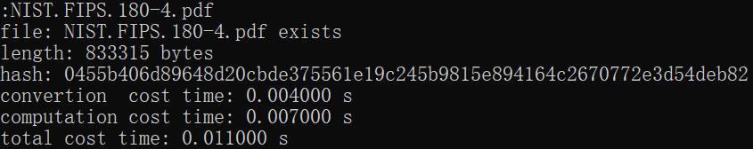

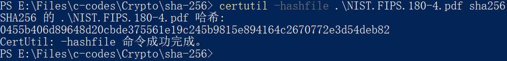

`..\..\test.mp4`

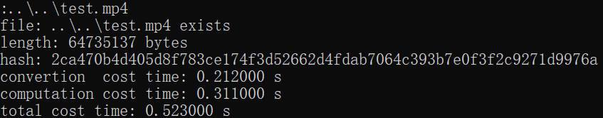


`..\..\movie.mp4`

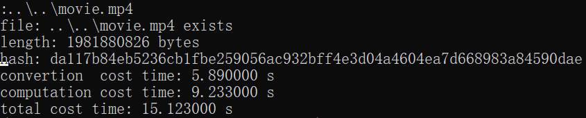


（无输入直接按`回车`键）

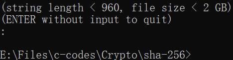

#### sha256fast.exe

（无输入直接按`回车`键）

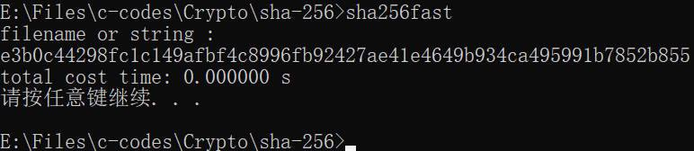

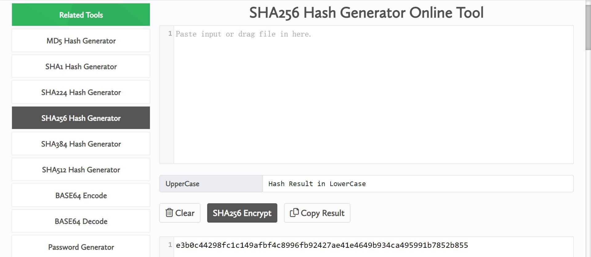

`hello`


`null.txt`


`NIST.FIPS.180-4.pdf`


`..\..\movie.mp4`


#### sha256min.exe

（无输入直接按`回车`键）

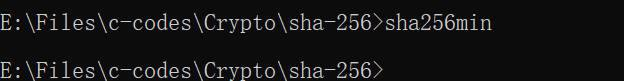

`null.txt`


`NIST.FIPS.180-4.pdf`

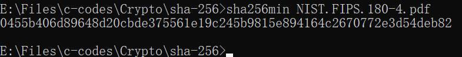

`..\..\movie.mp4`

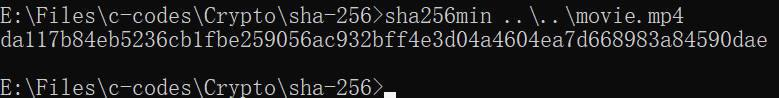

### Ubuntu20.04 x64

验证工具：

```bash
$ sha256sum <文件名>
```

#### sha256full

`hello`

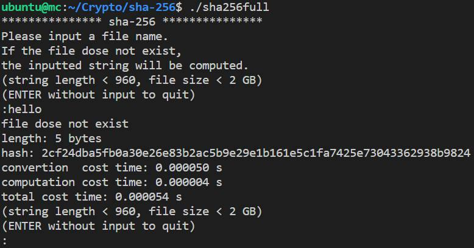

`NIST.FIPS.180-4.pdf`


#### sha256fast

（无输入直接按`回车`键）


`hello`


`NIST.FIPS.180-4.pdf`

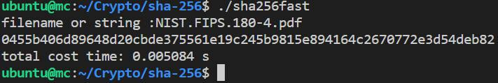

#### sha256min

`null.txt`


`NIST.FIPS.180-4.pdf`


Verification:


## 参考资料

[1] Wade Trappe, Lawrence C. Washington. **Introduction to Cryptography with Coding Theory (3rd edition)** [M]. Hoboken: Pearson Education, 2020: 499-521.

[2] FIPS PUB 180-4. **Secure Hash Standard (SHS)** [S]. [dx.doi.org/10.6028/NIST.FIPS.180-4](http://dx.doi.org/10.6028/NIST.FIPS.180-4)

[3] Datacruiser. **一文读懂SHA256算法原理及其实现**. [zhuanlan.zhihu.com/p/94619052](https://zhuanlan.zhihu.com/p/94619052)

[4] 小Q谈移动安全. **【密码学】一文读懂SHA-2**. [zhuanlan.zhihu.com/p/404879837](https://zhuanlan.zhihu.com/p/404879837)

## 延伸阅读

[1] Henri Gilbert, Helena Handschuh. **Security Analysis of SHA-256 and Sisters**. [link.springer.com/content/pdf/10.1007/978-3-540-24654-1_13.pdf](https://link.springer.com/content/pdf/10.1007/978-3-540-24654-1_13.pdf)

[2] in3rsha. **sha256-animation**. [github.com/in3rsha/sha256-animation](https://github.com/in3rsha/sha256-animation)

[3] [csrc.nist.gov/CSRC/media/Projects/Cryptographic-Standards-and-Guidelines/documents/examples/SHA256.pdf](https://csrc.nist.gov/CSRC/media/Projects/Cryptographic-Standards-and-Guidelines/documents/examples/SHA256.pdf)
